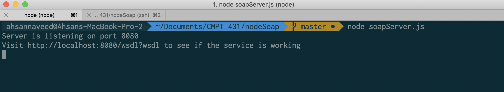
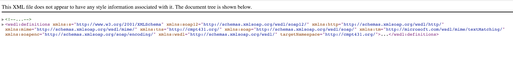
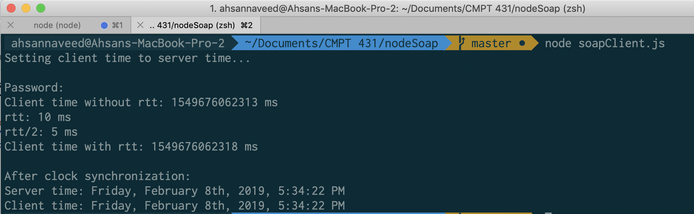

## CMPT 431 - Assignment 02

## Summary

A SOAP web service that uses the Web Service Definition Language WSDL (written by hand) and is deployed using SimpleHTTPServer (express server). Also, a SOAP client accesses the service we have created, in order to perform the same clock synchronization scheme as in Assignment 1. Exchanged data is formatted to JSON string and is parsed back to JSON on both client and server side.

## Service Definition

```xml
<wsdl:service name="ServerTimeService">
    <wsdl:port name="ServerTimeServiceSoapPort" binding="tns:ServerTimeServiceSoapBinding">
        <soap:address location="http://localhost:8080/wsdl" />
    </wsdl:port>
    <wsdl:port name="ServerTimeServiceSoap12Port" binding="tns:ServerTimeServiceSoap12Binding">
        <soap12:address location="http://localhost:8080/wsdl" />
    </wsdl:port>
</wsdl:service>
```

## Service Architecture (Design)

Client sends an XML request to the Server and then server responds back with an XML message, the actual time exchange is happening in JSON as mentioned earlier. We have choosen Node.js for this assignment due to the ease of implementation and easy to understand project folder structure as compared to a Java based web service where we were getting unwanted and a lot of auto-generated code (as we have experimented with different Java based frameworks). With our current implementation we have written WSDL manually and this has given us an opportunity to understand WSDL in great detail. After understanding WSDL we came up with two approaches to exchange data in JSON.

First one was to actually create a complex data type within our `.wsdl` file which would resemble a JSON object of the following structure `{ serverTime: value }` and the second approach was to exchange data with a primitive wsdl datatype i.e. `string` (a JSON string) and parse that string into a JSON object at both client and server side. We ended up choosing the latter for the sake of implementing more readable code and smaller xml file. After some research we found out that this approach has been used by Microsoft too to support their legacy SOAP web services so that such services integrate well with their RESTful web services (which supports JSON based data exchange) with minimal code changes.

## Getting Started

1. `git clone https://github.com/ahsannaveed007/node-soap.git`
2. `cd node-soap`
3. `npm install`
4. Start server: `node soapServer.js`
5. Start client: `node soapClient.js`
   _Note:_ Run client and server on two different unix machines.

## Output

1. SOAP Server
   

2. Visit `http://localhost:8080/wsdl?wsdl`
   

3. SOAP Client
   

## References:

1. https://www.tutorialspoint.com/wsdl
2. https://github.com/vpulim/node-soap
